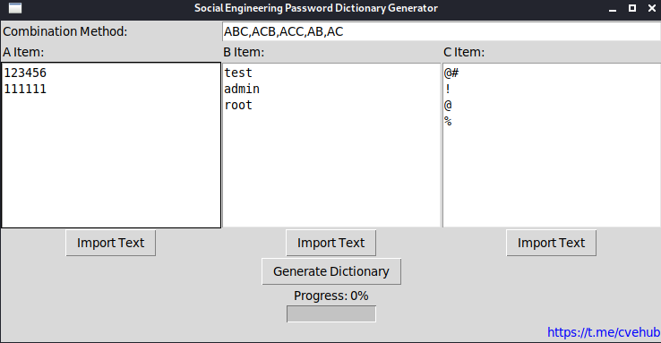

# Social Engineering Password Dictionary Generator

This tool is designed to generate potential password combinations using social engineering techniques.

## Requirements

- Python 3.6 or higher
- tkinter
- password_strength

## Installation

1. Download

2. Install the required libraries:
pip install -r requirements.txt

## Usage

1. python SEPDG.py

2. Enter the combination method, separated by commas.

3. Input or import items A, B, and C, which can be historical passwords, parts of historical passwords, or birthdays, years, or mobile phone numbers.

4. Click the "Generate Dictionary" button to generate the password dictionary.

## Disclaimer

This tool is intended for educational and ethical purposes only. Do not use it for any illegal activities. The developer is not responsible for any misuse of this tool.
